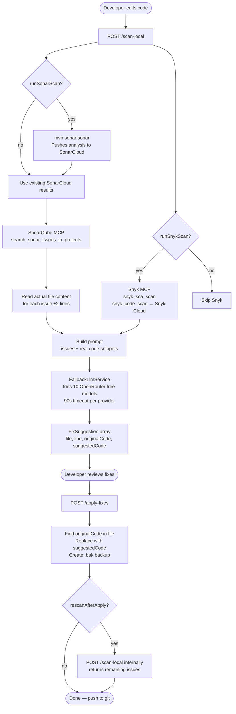
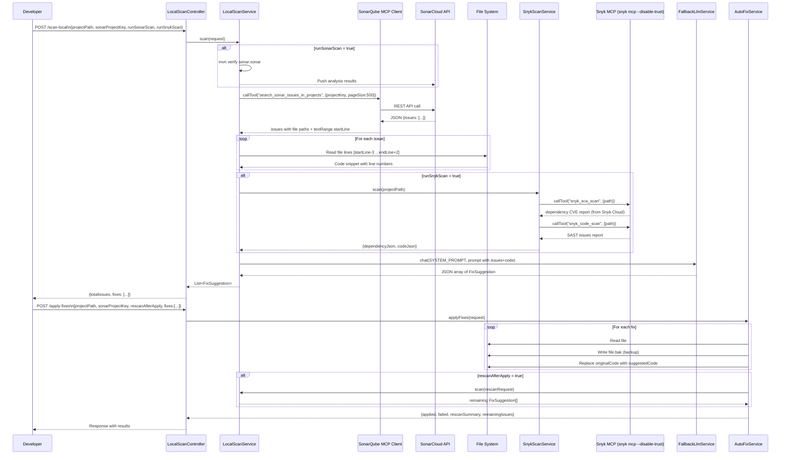
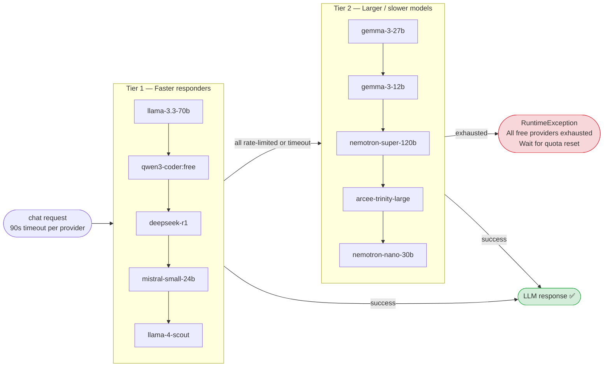
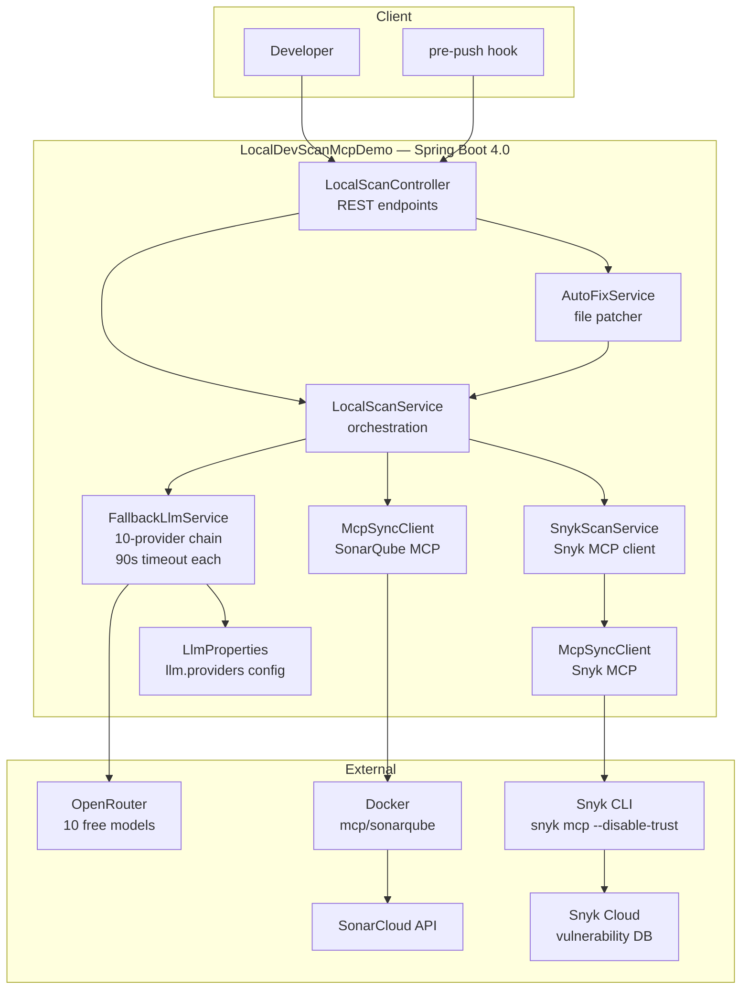

# LocalDevScanMcpDemo — Local Pre-PR Quality Gate

Fix bugs, vulnerabilities, and code smells **locally before creating a PR**, so the CI pipeline passes on the first run.

---

## Table of Contents

1. [What It Does](#what-it-does)
2. [High-Level Flow](#high-level-flow)
3. [Detailed Component Flow](#detailed-component-flow)
4. [LLM Fallback Chain](#llm-fallback-chain)
5. [Apply-Fixes Flow](#apply-fixes-flow)
6. [Quick Start](#quick-start)
7. [Running on a New Machine](#running-on-a-new-machine)
8. [Scanning a Different Project](#scanning-a-different-project)
9. [API Reference](#api-reference)
10. [Pre-Push Git Hook](#pre-push-git-hook)
11. [Architecture](#architecture)
12. [Supported LLMs](#supported-llms)
13. [Environment Variables](#environment-variables)
14. [Troubleshooting](#troubleshooting)

---

## What It Does

The app acts as a **local quality gate** that runs before you push code. It:

- Fetches existing SonarCloud issues for your project (or runs a fresh scan)
- Runs Snyk to find dependency CVEs
- Reads the **actual source code** at each issue location
- Asks an LLM to generate precise fix suggestions with exact `originalCode` → `suggestedCode`
- Lets you apply the fixes directly to files on disk (with `.bak` backups)
- Optionally rescans after applying to confirm the remaining issue count

---

## High-Level Flow



---

## Detailed Component Flow



---

## LLM Fallback Chain

The app never uses paid models without explicit opt-in (`paid: false` in config). It tries providers in order until one responds:



**All 10 providers use a single `OPENROUTER_API_KEY` environment variable.**

**On each failure:**
- HTTP 429 / rate-limited → log warning, try next
- HTTP 402 / payment required → log warning, skip
- 90-second timeout → `⏱️ Timeout` log, try next
- Empty / `null` response → `Empty/null response` log, try next
- `paid: true` entries → skipped silently (never called)

---

## Apply-Fixes Flow


---

## Quick Start

### Prerequisites

- **Java 17+** on PATH
- **Node.js + npm** on PATH (`node --version` should work)
- **Snyk CLI** installed globally: `npm install -g snyk` (v1.1298.0+)
- **Docker Desktop** running — needed for the SonarQube MCP server (`docker ps` should work)
- **`OPENROUTER_API_KEY`** environment variable set
- Your project already analysed in SonarCloud at least once

### 1. Install Snyk CLI globally (once per machine)

```bash
npm install -g snyk
snyk --version   # must be 1.1298.0 or later
```

### 2. Set OpenRouter API key

```bash
# Linux / Mac / Git Bash
export OPENROUTER_API_KEY=sk-or-v1-...

# Windows — persists across sessions
setx OPENROUTER_API_KEY "sk-or-v1-..."
```

Get a free key at [openrouter.ai/keys](https://openrouter.ai/keys). Restart your terminal after `setx`.

### 3. Clone and Build

```bash
git clone <repo-url>
cd LocalDevScanMcpDemo
./gradlew bootJar
```

### 4. Configure `application.yaml`

Edit `src/main/resources/application.yaml` — only the `scan` section needs to change per project:

```yaml
scan:
  project-path: C:/path/to/your/project      # ← absolute path to the project to scan
  sonar-project-key: your-org_your-project   # ← SonarCloud project key
  branch: main
  run-sonar-scan: false   # set true to trigger mvn sonar:sonar first
  run-snyk-scan: true
```

Also set your SonarCloud and Snyk credentials once:

```yaml
sonarqube:
  token: <your-sonarcloud-token>
  org: <your-sonarcloud-org>

snyk:
  token: <your-snyk-token>    # from app.snyk.io/account
  org-id: <your-snyk-org-slug>  # e.g. vivid-vortex
```

### 5. Start the Server

```bash
# Linux / Mac / Git Bash
MSYS_NO_PATHCONV=1 java -jar build/libs/LocalDevScanMcpDemo-0.0.1-SNAPSHOT.jar

# Windows CMD
run.bat
```

> **Startup time:** ~20 seconds — wait for both:
> ```
> SonarQube MCP client ready
> Snyk MCP client ready — 11 tool(s) available
> ```
>
> **Port conflict:** If port 8080 is busy: `java -Dserver.port=8081 -jar ...`

### 6. Verify Config

```bash
curl http://localhost:8080/scan-config
```

Confirm `projectPath`, `sonarProjectKey`, and `snykEnabled` look correct.

### 7. Scan Your Project

```bash
# Uses all defaults from application.yaml
curl -X POST http://localhost:8080/scan-local \
  -H "Content-Type: application/json" \
  -d "{}"
```

Or override specific fields:

```bash
curl -X POST http://localhost:8080/scan-local \
  -H 'Content-Type: application/json' \
  -d '{
    "projectPath": "C:/path/to/your/project",
    "sonarProjectKey": "your-org_your-project",
    "branch": "main",
    "runSonarScan": false,
    "runSnykScan": true
  }'
```

**Response:** JSON with `totalIssues` and a `fixes` array — each entry has `file`, `startLine`, `severity`, `originalCode`, `suggestedCode`, `explanation`.

### 8. Apply Fixes

```bash
curl -X POST http://localhost:8080/apply-fixes \
  -H 'Content-Type: application/json' \
  -d '{
    "projectPath": "C:/path/to/your/project",
    "sonarProjectKey": "your-org_your-project",
    "rescanAfterApply": true,
    "fixes": [ ... paste fixes array from scan response ... ]
  }'
```

After this runs, check the patched files with `git diff` in your project directory. Original files are backed up as `.bak`.

---

## Running on a New Machine

Everything needed to run the app is inside the repository — no environment variables, no separate config files. Follow these steps after cloning on any machine.

### Step 1 — Check prerequisites

```bash
# Java 17+ required
java -version

# Node.js + npm required (for Snyk CLI)
node --version
npm --version

# Install Snyk CLI globally (one-time, v1.1298.0+ required for MCP support)
npm install -g snyk
snyk --version   # should print 1.1298.0 or later

# Docker Desktop must be running (for SonarQube MCP)
docker --version
docker ps        # should list containers with no error
```

- Java 17+ → [adoptium.net](https://adoptium.net)
- Node.js → [nodejs.org](https://nodejs.org) (LTS version recommended)
- Docker Desktop → [docker.com](https://www.docker.com/products/docker-desktop)

### Step 1b — Set OpenRouter API key

All 10 LLM providers use a single OpenRouter key. Set it once as an environment variable:

```bash
# Linux / Mac
export OPENROUTER_API_KEY=sk-or-v1-...

# Windows (persists across sessions)
setx OPENROUTER_API_KEY "sk-or-v1-..."
# Then open a new terminal for setx to take effect
```

Get a free key at [openrouter.ai/keys](https://openrouter.ai/keys).

### Step 2 — Clone this repo

```bash
git clone <LocalDevScanMcpDemo-repo-url>
cd LocalDevScanMcpDemo
```

### Step 3 — Clone the project you want to scan

Clone the target project separately and check out the branch you want to scan:

```bash
git clone https://github.com/your-org/your-project.git
cd your-project
git checkout feature/your-branch
```

### Step 4 — Update `application.yaml`

Open `src/main/resources/application.yaml` and change **only the `scan` section**. Everything else (SonarCloud token, Snyk token, LLM providers) is already set.

```yaml
scan:
  project-path: C:/path/to/your-project        # absolute path to the cloned project
  sonar-project-key: your-sonarcloud-key        # find in SonarCloud → Project Information
  branch: feature/your-branch                   # branch you checked out above
  run-sonar-scan: false                         # false = use existing SonarCloud results
  run-snyk-scan: true                           # true = call snyk_sca_scan + snyk_code_scan
```

> **Finding your SonarCloud project key:** Log in to [sonarcloud.io](https://sonarcloud.io) → open your project → **Project Information** (bottom left) → copy the **Project Key**.

> **No pom.xml / build file?** Set `run-snyk-scan: false` — Snyk needs a dependency manifest to scan.

### Step 5 — Build and start the server

```bash
# Linux / Mac / Git Bash
./run.sh

# Windows CMD
run.bat

# Or manually
./gradlew bootJar
java -jar build/libs/LocalDevScanMcpDemo-0.0.1-SNAPSHOT.jar
```

Wait for these lines in the console (both MCP clients must initialize):
```
SonarQube MCP client ready — N tool(s) available
Snyk MCP client ready — 11 tool(s) available
Started Application in XX seconds
```

Typical startup: **15–25 seconds** (SonarQube Docker + Snyk CLI both initializing).

### Step 6 — Verify config

```bash
curl http://localhost:8080/scan-config
```

Confirm `projectPath`, `sonarProjectKey`, and `branch` match what you set in Step 4.

### Step 7 — Run the scan

```bash
curl -X POST http://localhost:8080/scan-local \
  -H "Content-Type: application/json" \
  -d "{}"
```

Empty body `{}` — all values come from `application.yaml`.

Typical scan times:
- **SonarQube MCP** — 2–5 seconds (fetches from SonarCloud)
- **Snyk MCP** — 5–15 seconds (Snyk CLI reads files + queries Snyk Cloud; no Docker pull needed)
- **LLM** — 30s–3min depending on which OpenRouter model responds first

### Step 8 — Apply fixes

Copy any fix from the scan response and post it to `/apply-fixes`:

```bash
curl -X POST http://localhost:8080/apply-fixes \
  -H "Content-Type: application/json" \
  -d '{
    "rescanAfterApply": true,
    "fixes": [ { ...paste fix object from scan response... } ]
  }'
```

`projectPath`, `sonarProjectKey`, and `branch` are optional — picked up from `application.yaml` automatically.

### Troubleshooting

| Problem | Cause | Fix |
|---------|-------|-----|
| Server won't start — `snyk: command not found` | Snyk CLI not installed | Run `npm install -g snyk`, then restart server |
| Server won't start — `Snyk MCP client ready — 0 tools` | Snyk CLI older than v1.1298.0 (no MCP support) | Run `npm install -g snyk@latest` |
| Server won't start — Docker error | Docker Desktop not running | Start Docker Desktop, wait for whale icon to stop animating |
| Port 8080 busy | Another process using 8080 | Start with `java -Dserver.port=8081 -jar ...` and use port 8081 in all curl calls |
| `projectPath is required` | `scan.project-path` blank in YAML | Check `application.yaml` — path must be absolute with forward slashes |
| `sonarProjectKey is required` | `scan.sonar-project-key` blank in YAML | Find key in SonarCloud → Project Information |
| All LLM providers exhausted | OpenRouter free quota used up | Wait 10–30 min for per-minute rate limits to reset. The app will retry automatically on next scan. |
| LLM provider takes 3+ minutes | Slow OpenRouter model (nemotron, arcee) | Normal — these hit the 90s timeout and the chain moves on. Tier 1 models (llama, qwen, deepseek) are faster. |
| `OPENROUTER_API_KEY` not found | Env var not set or set with `setx` but terminal not restarted | On Windows, open a new terminal after `setx`. Or start server with: `OPENROUTER_API_KEY=sk-or-v1-... java -jar ...` |
| Snyk `snyk_sca_scan` returns auth error | Snyk token expired (UAT tokens expire in 90 days) | Regenerate token at [app.snyk.io/account](https://app.snyk.io/account), update `snyk.token` in YAML |
| Snyk `snyk_code_scan` fails | Snyk Code not enabled on account | [app.snyk.io](https://app.snyk.io) → Settings → Snyk Code → toggle On. Dependency scan still works. |
| Snyk returns "No manifest files" | No `pom.xml` / `build.gradle` on scanned branch | Set `run-snyk-scan: false` for branches without build files |
| `originalCode not found` when applying fixes | LLM paraphrased code slightly | Re-run `/scan-local` to get fresh `originalCode` from current file. Always use fixes exactly as returned. |
| Wrong project being scanned | Stale YAML values | Run `GET /scan-config` to verify loaded values. Save `application.yaml` and restart server. |

---

## Scanning a Different Project

To point the app at a different project or branch, **only change these lines** in `application.yaml` and restart the server. No code changes needed.

```yaml
scan:
  project-path: C:/path/to/new-project          # ← change
  sonar-project-key: new-sonarcloud-key          # ← change
  branch: feature/new-branch                     # ← change
  run-sonar-scan: false                          # true = run mvn sonar:sonar first (~2 min)
  run-snyk-scan: true                            # false = skip if no pom.xml / build file
  maven-executable: mvn                          # or ./mvnw if project uses wrapper
```

> **Snyk MCP automatically detects the project type** (Maven, Gradle, Node, Python) from the manifest files in the project directory — no image configuration needed.

After saving, restart the server and call `GET /scan-config` to confirm the new values loaded. Then run `POST /scan-local` with an empty body `{}`.

---

## API Reference

### `POST /scan-local`

Scans a local project and returns LLM-generated fix suggestions.

**Request body:**

| Field | Type | Default | Description |
|-------|------|---------|-------------|
| `projectPath` | string | required | Absolute path to project root |
| `sonarProjectKey` | string | required | SonarCloud project key |
| `branch` | string | `null` | Branch name (informational only) |
| `runSonarScan` | boolean | `true` | Run `mvn sonar:sonar` first (~2 min) |
| `runSnykScan` | boolean | `true` | Run Snyk via Docker |

**Response:**

```json
{
  "projectPath": "C:/path/to/project",
  "sonarProjectKey": "org_project",
  "branch": "main",
  "totalIssues": 30,
  "fixes": [
    {
      "file": "src/main/java/com/example/HelloController.java",
      "startLine": 12,
      "endLine": 12,
      "issue": "Strings and Boxed types should be compared using \"equals()\".",
      "severity": "MAJOR",
      "source": "sonarqube",
      "ruleId": "java:S4973",
      "originalCode": "if (password == \"hardcoded_password\") { // Bug: string comparison",
      "suggestedCode": "if (password.equals(\"hardcoded_password\")) { // Bug: string comparison",
      "explanation": "The == operator checks reference equality; .equals() checks content.",
      "applied": false
    }
  ]
}
```

---

### `POST /apply-fixes`

Applies selected fix suggestions to files on disk.

**Request body:**

| Field | Type | Default | Description |
|-------|------|---------|-------------|
| `projectPath` | string | required | Absolute path to project root |
| `sonarProjectKey` | string | optional | Needed for `rescanAfterApply` |
| `branch` | string | optional | Needed for `rescanAfterApply` |
| `rescanAfterApply` | boolean | `false` | Re-run scan after applying fixes |
| `fixes` | array | required | FixSuggestion objects from `/scan-local` |

**Response:**

```json
{
  "appliedCount": 1,
  "failedCount": 0,
  "applied": [ { "...": "fix that was applied" } ],
  "failed": [],
  "rescanNote": "Rescan complete: 29 remaining issue(s) from SonarCloud (applied 1 local fix(es) — run mvn sonar:sonar then rescan to see updated count)",
  "remainingIssues": 29,
  "rescanFixes": [ { "...": "remaining fix suggestions" } ]
}
```

> **Note on rescan:** `remainingIssues` reflects SonarCloud's last analysis. Local file patches are not visible in SonarCloud until you run `mvn sonar:sonar` again.

**How apply works:**
1. Reads the target file
2. Searches for `originalCode` (tries exact match, then CRLF-normalized match)
3. Creates a `.bak` backup (`HelloController.java` → `HelloController.java.bak`)
4. Replaces `originalCode` with `suggestedCode` and writes the file

---

## Pre-Push Git Hook

Install a hook that automatically runs the scan before every `git push`:

```bash
bash /path/to/LocalDevScanMcpDemo/hooks/install-hooks.sh /path/to/your/repo
```

**Hook behaviour:**


```bash
# Install into any git repo
bash hooks/install-hooks.sh /path/to/your/repo

# Uninstall
rm /path/to/your/repo/.git/hooks/pre-push
```

Override the server URL if running on a different port:

```bash
MCP_SERVER_URL=http://localhost:8081 git push
```

---

## Architecture



### Key Design Decisions

| Decision | Reason |
|----------|--------|
| `McpSyncClient.callTool()` directly (no LLM tool-calling) | Reliable, no hallucination of tool arguments |
| Two separate MCP clients (SonarQube + Snyk) | Each initializes once at boot; scans reuse the running process — no per-scan Docker overhead |
| `snyk mcp -t stdio --disable-trust` | `--disable-trust` prevents the browser-confirmation prompt that blocks headless operation |
| Read actual file content ±2 lines per issue | LLM sees real code → accurate `originalCode` (no hallucination) |
| `java.net.http.HttpClient` with 90s total timeout | Replaces `RestTemplate` + `SimpleClientHttpRequestFactory`; timeout covers entire request including streaming |
| `paid: true` flag in config | Prevents accidental paid API usage; explicit opt-in per provider |
| `${OPENROUTER_API_KEY}` env var (not hardcoded) | Prevents API key leaks via git commits |
| `.bak` backup before patching | Safe rollback without git |
| `textRange.startLine` over top-level `line` | SonarCloud MCP returns line in `textRange`, not root field |

---

## Supported LLMs

All 10 configured providers use OpenRouter's free tier. Any OpenAI-compatible API can be added:

| Provider | Base URL | Example Free Models |
|----------|----------|---------------------|
| **OpenRouter** (all 10 configured) | `https://openrouter.ai/api/v1` | `meta-llama/llama-3.3-70b-instruct:free`, `qwen/qwen3-coder:free`, `deepseek/deepseek-r1:free` |
| **OpenAI** (add if needed) | `https://api.openai.com/v1` | `gpt-4o-mini` (set `paid: true`) |
| **Azure OpenAI** (add if needed) | your Azure endpoint | deployment name |

All current providers use `api-key: ${OPENROUTER_API_KEY}` — set this env var and all 10 are ready.

**Adding a new provider:**

```yaml
llm:
  providers:
    - name: my-provider
      base-url: https://api.example.com/v1
      api-key: ${MY_API_KEY}           # use env var to avoid committing keys
      completions-path: /chat/completions
      model: my-model-name
      paid: false   # set true to exclude from automatic use
```

---

## Environment Variables

| Variable | Required | Description |
|----------|----------|-------------|
| `OPENROUTER_API_KEY` | **Required** | All 10 LLM providers use this single key. Get a free key at [openrouter.ai/keys](https://openrouter.ai/keys). Set with `setx OPENROUTER_API_KEY "sk-or-v1-..."` on Windows. |
| `MSYS_NO_PATHCONV` | Git Bash only | Set to `1` to prevent Git Bash from converting `/chat/completions` to a Windows path. Already set in `run.sh`. |

All other credentials (SonarCloud token, Snyk token, org IDs) are embedded in `application.yaml`. No other environment variables are required.

---

## Troubleshooting

### Server won't start — port already in use
```bash
# Start on a different port
java -Dserver.port=8081 -jar build/libs/LocalDevScanMcpDemo-0.0.1-SNAPSHOT.jar

# Then use port 8081 in all curl calls
curl http://localhost:8081/scan-config
```

### Server won't start — Snyk CLI not found
```
Error: SonarQube / Snyk MCP client initialization failed
```
Either `snyk` is not installed, or the Snyk CLI version is too old. Fix:
```bash
npm install -g snyk@latest
snyk --version    # should be 1.1298.0+
```

### Server won't start — Docker not running
The SonarQube MCP client (`mcp/sonarqube` Docker image) starts on application boot. If Docker is not running, the app fails to start.
```bash
docker ps    # must work with no error before starting the app
```

### `projectPath is required` or `sonarProjectKey is required`
The `scan.*` values in `application.yaml` are blank or the file wasn't saved. Check:
```bash
curl http://localhost:8080/scan-config   # shows what's actually loaded
```

### All LLM providers exhausted
OpenRouter free tier uses per-minute rate limits shared across all users. When all 10 providers hit their rate limit:
```
RuntimeException: All free LLM providers exhausted. Tried: llama-3.3-70b, qwen3-coder-free, ...
```
Wait 10–30 minutes for the per-minute limits to reset, then retry. The rate limits reset quickly (not daily).

While waiting, check the server logs to see which providers were tried:
```
⚠ Rate-limited on llama-3.3-70b, trying next...
⏱️  Timeout (90s) on arcee-trinity-large, trying next...
✅ Got response from provider: deepseek-r1
```

### Snyk scan slow on first run after installing
On the first run after installing or upgrading the Snyk CLI, the CLI performs a background update check. Subsequent runs are faster. This is expected and normal.

### Snyk `snyk_code_scan` fails or returns empty
Snyk Code (SAST) requires enabling in your account:
1. Log in to [app.snyk.io](https://app.snyk.io)
2. Go to **Settings → Snyk Code**
3. Toggle **Enable Snyk Code** → On

Dependency scanning (`snyk_sca_scan`) continues to work regardless.

### `originalCode not found` when applying fixes
The LLM's `originalCode` doesn't exactly match the file content. This happens when:
- The file was already partially fixed
- Line endings differ (CRLF vs LF) — the app normalizes these automatically
- The LLM added/removed leading whitespace

Re-run `/scan-local` to get a fresh `originalCode` from the current file state.

### Git Bash path conversion errors (`/chat/completions` → Windows path)
```bash
# Always start the server with this prefix in Git Bash
MSYS_NO_PATHCONV=1 java -jar build/libs/LocalDevScanMcpDemo-0.0.1-SNAPSHOT.jar
```
This is handled automatically by `run.sh`.

### Wrong project being scanned
Run `GET /scan-config` to verify what's loaded. If stale values appear, ensure you saved `application.yaml` and restarted the server (not just reloaded).
