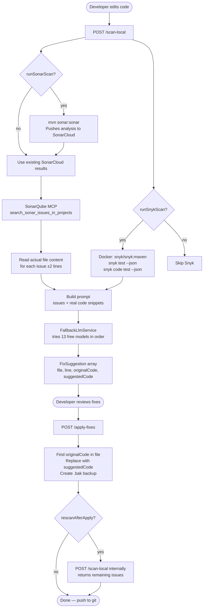
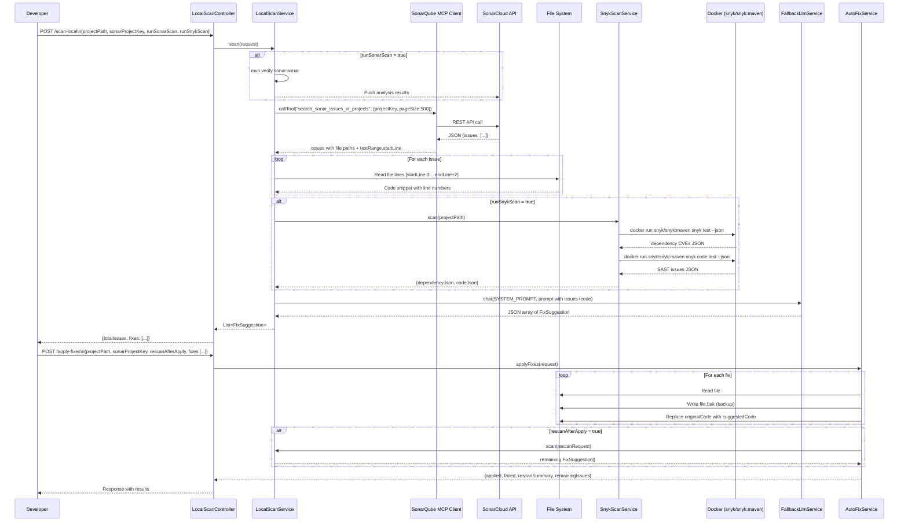
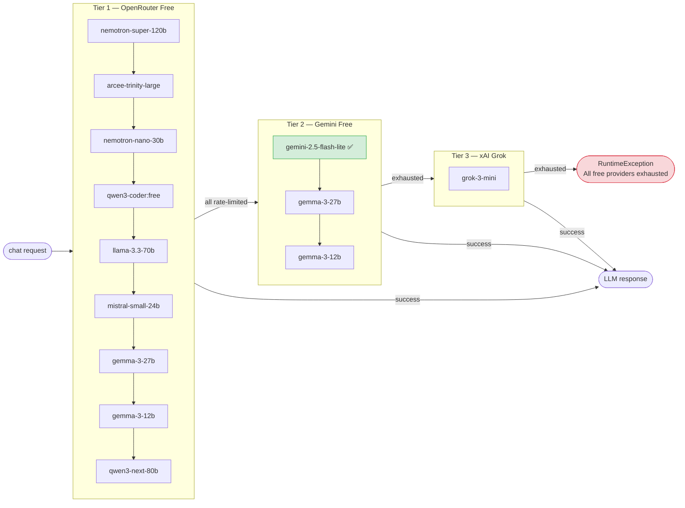
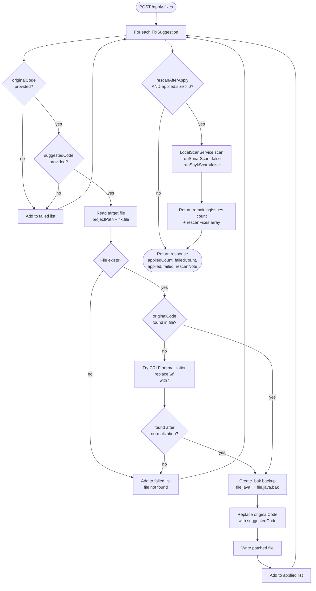
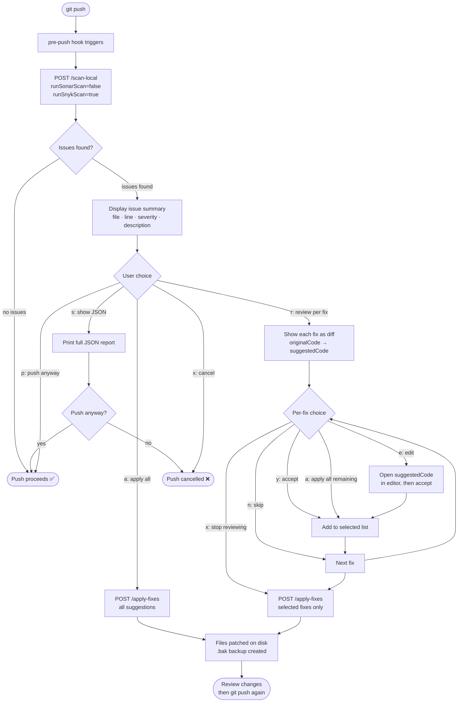
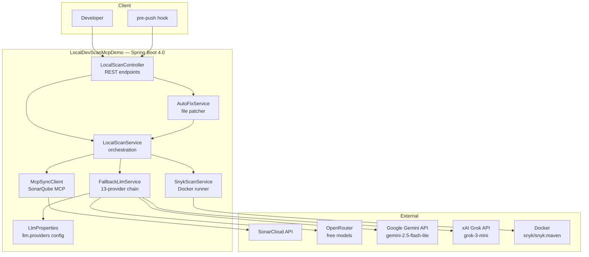

# LocalDevScanMcpDemo — Local Pre-PR Quality Gate

Fix bugs, vulnerabilities, and code smells **locally before creating a PR**, so the CI pipeline passes on the first run.

---

## Table of Contents

1. [What It Does](#what-it-does)
2. [High-Level Flow](#high-level-flow)
3. [Detailed Component Flow](#detailed-component-flow)
4. [LLM Fallback Chain](#llm-fallback-chain)
5. [Apply-Fixes Flow](#apply-fixes-flow)
6. [Quick Start](#quick-start)
7. [API Reference](#api-reference)
8. [Pre-Push Git Hook](#pre-push-git-hook)
9. [Architecture](#architecture)
10. [Supported LLMs](#supported-llms)
11. [Snyk Docker Images](#snyk-docker-images)
12. [Environment Variables](#environment-variables)

---

## What It Does

The app acts as a **local quality gate** that runs before you push code. It:

- Fetches existing SonarCloud issues for your project (or runs a fresh scan)
- Runs Snyk to find dependency CVEs
- Reads the **actual source code** at each issue location
- Asks an LLM to generate precise fix suggestions with exact `originalCode` → `suggestedCode`
- Lets you apply the fixes directly to files on disk (with `.bak` backups)
- Optionally rescans after applying to confirm the remaining issue count

---

## High-Level Flow



---

## Detailed Component Flow



---

## LLM Fallback Chain

The app never uses paid models without explicit opt-in (`paid: false` in config). It tries providers in order until one responds:



**On each failure:**
- HTTP 429 / rate-limited → log warning, try next
- HTTP 402 / payment required → log warning, try next
- Any other error → log warning, try next
- `paid: true` entries → skipped silently (never called)

---

## Apply-Fixes Flow



---

## Quick Start

### Prerequisites

- Java 17+ on PATH
- Docker Desktop running (`docker ps` should work)
- Your project already analysed in SonarCloud at least once

### 1. Clone and Build

```bash
git clone <repo-url>
cd LocalDevScanMcpDemo
./gradlew bootJar
```

### 2. Start the Server

```bash
MSYS_NO_PATHCONV=1 java -jar build/libs/LocalDevScanMcpDemo-0.0.1-SNAPSHOT.jar
```

> **Windows Git Bash:** `MSYS_NO_PATHCONV=1` prevents Git Bash from converting `/chat/completions` to a Windows path.
>
> **Port conflict:** If port 8080 is busy: `java -Dserver.port=8081 -jar ...`

Or use the provided scripts:

```bash
# Linux / Mac / Git Bash
./run.sh

# Windows CMD
run.bat
```

### 3. Scan Your Project

```bash
curl -X POST http://localhost:8080/scan-local \
  -H 'Content-Type: application/json' \
  -d '{
    "projectPath": "C:/path/to/your/project",
    "sonarProjectKey": "your-org_your-project",
    "branch": "main",
    "runSonarScan": false,
    "runSnykScan": true
  }'
```

### 4. Apply Fixes

```bash
curl -X POST http://localhost:8080/apply-fixes \
  -H 'Content-Type: application/json' \
  -d '{
    "projectPath": "C:/path/to/your/project",
    "sonarProjectKey": "your-org_your-project",
    "branch": "main",
    "rescanAfterApply": true,
    "fixes": [ ... paste fixes from scan response ... ]
  }'
```

---

## API Reference

### `POST /scan-local`

Scans a local project and returns LLM-generated fix suggestions.

**Request body:**

| Field | Type | Default | Description |
|-------|------|---------|-------------|
| `projectPath` | string | required | Absolute path to project root |
| `sonarProjectKey` | string | required | SonarCloud project key |
| `branch` | string | `null` | Branch name (informational only) |
| `runSonarScan` | boolean | `true` | Run `mvn sonar:sonar` first (~2 min) |
| `runSnykScan` | boolean | `true` | Run Snyk via Docker |

**Response:**

```json
{
  "projectPath": "C:/path/to/project",
  "sonarProjectKey": "org_project",
  "branch": "main",
  "totalIssues": 30,
  "fixes": [
    {
      "file": "src/main/java/com/example/HelloController.java",
      "startLine": 12,
      "endLine": 12,
      "issue": "Strings and Boxed types should be compared using \"equals()\".",
      "severity": "MAJOR",
      "source": "sonarqube",
      "ruleId": "java:S4973",
      "originalCode": "if (password == \"hardcoded_password\") { // Bug: string comparison",
      "suggestedCode": "if (password.equals(\"hardcoded_password\")) { // Bug: string comparison",
      "explanation": "The == operator checks reference equality; .equals() checks content.",
      "applied": false
    }
  ]
}
```

---

### `POST /apply-fixes`

Applies selected fix suggestions to files on disk.

**Request body:**

| Field | Type | Default | Description |
|-------|------|---------|-------------|
| `projectPath` | string | required | Absolute path to project root |
| `sonarProjectKey` | string | optional | Needed for `rescanAfterApply` |
| `branch` | string | optional | Needed for `rescanAfterApply` |
| `rescanAfterApply` | boolean | `false` | Re-run scan after applying fixes |
| `fixes` | array | required | FixSuggestion objects from `/scan-local` |

**Response:**

```json
{
  "appliedCount": 1,
  "failedCount": 0,
  "applied": [ { "...": "fix that was applied" } ],
  "failed": [],
  "rescanNote": "Rescan complete: 29 remaining issue(s) from SonarCloud (applied 1 local fix(es) — run mvn sonar:sonar then rescan to see updated count)",
  "remainingIssues": 29,
  "rescanFixes": [ { "...": "remaining fix suggestions" } ]
}
```

> **Note on rescan:** `remainingIssues` reflects SonarCloud's last analysis. Local file patches are not visible in SonarCloud until you run `mvn sonar:sonar` again.

**How apply works:**
1. Reads the target file
2. Searches for `originalCode` (tries exact match, then CRLF-normalized match)
3. Creates a `.bak` backup (`HelloController.java` → `HelloController.java.bak`)
4. Replaces `originalCode` with `suggestedCode` and writes the file

---

## Pre-Push Git Hook

Install a hook that automatically runs the scan before every `git push`:

```bash
bash /path/to/LocalDevScanMcpDemo/hooks/install-hooks.sh /path/to/your/repo
```

**Hook behaviour:**



```bash
# Install into any git repo
bash hooks/install-hooks.sh /path/to/your/repo

# Uninstall
rm /path/to/your/repo/.git/hooks/pre-push
```

Override the server URL if running on a different port:

```bash
MCP_SERVER_URL=http://localhost:8081 git push
```

---

## Architecture



### Key Design Decisions

| Decision | Reason |
|----------|--------|
| `McpSyncClient.callTool()` directly (no LLM tool-calling) | Reliable, no hallucination of tool arguments |
| Read actual file content ±2 lines per issue | LLM sees real code → accurate `originalCode` (no hallucination) |
| RestTemplate fallback chain (not Spring AI `ChatClient`) | Fine-grained control over provider switching on 429/402 |
| `paid: true` flag in config | Prevents accidental paid API usage; explicit opt-in per provider |
| `.bak` backup before patching | Safe rollback without git |
| `textRange.startLine` over top-level `line` | SonarCloud MCP returns line in `textRange`, not root field |

---

## Supported LLMs

Any OpenAI-compatible API works. Configure in `application.yaml` under `llm.providers`:

| Provider | Base URL | Example Models |
|----------|----------|----------------|
| **OpenRouter** (free tier) | `https://openrouter.ai/api/v1` | `nvidia/nemotron-3-super-120b-a12b:free`, `meta-llama/llama-3.3-70b-instruct:free` |
| **Gemini** (recommended fallback) | `https://generativelanguage.googleapis.com/v1beta/openai` | `models/gemini-2.5-flash-lite` |
| **xAI Grok** | `https://api.x.ai/v1` | `grok-3-mini` (activate at console.x.ai first) |
| **OpenAI** | `https://api.openai.com/v1` | `gpt-4o-mini` |
| **Azure OpenAI** | your Azure endpoint | deployment name |

**Adding a new provider:**

```yaml
llm:
  providers:
    - name: my-provider
      base-url: https://api.example.com/v1
      api-key: your-api-key
      completions-path: /chat/completions
      model: my-model-name
      paid: false   # set true to exclude from automatic use
```

---

## Snyk Docker Images

| Project Type | Docker Image | Set in config |
|-------------|-------------|---------------|
| **Maven (Java)** | `snyk/snyk:maven` | default |
| Gradle (Java) | `snyk/snyk:gradle` | `snyk.docker-image: snyk/snyk:gradle` |
| Node.js | `snyk/snyk:node` | `snyk.docker-image: snyk/snyk:node` |
| Python | `snyk/snyk:python` | `snyk.docker-image: snyk/snyk:python` |

> **Important:** Do NOT use `snyk/snyk:node` for Java projects — it has no Maven and will fail with `spawn mvn ENOENT`.

---

## Environment Variables

All credentials are embedded in `application.yaml` for easy cloning. These environment variables override YAML values if set:

| Variable | YAML key | Description |
|----------|----------|-------------|
| `SONARQUBE_TOKEN` | `sonarqube.token` | SonarCloud user token |
| `SONARQUBE_URL` | `sonarqube.url` | SonarCloud URL |
| `SONARQUBE_ORG` | `sonarqube.org` | SonarCloud organization key |
| `SNYK_TOKEN` | `snyk.token` | Snyk API token |
| `SNYK_DOCKER_IMAGE` | `snyk.docker-image` | Default: `snyk/snyk:maven` |
| `OPENAI_API_KEY` | `spring.ai.openai.api-key` | For Spring AI ChatController endpoints |
| `OPENAI_BASE_URL` | `spring.ai.openai.base-url` | For Spring AI ChatController endpoints |
| `MSYS_NO_PATHCONV` | — | Set to `1` in Git Bash to prevent path conversion |
