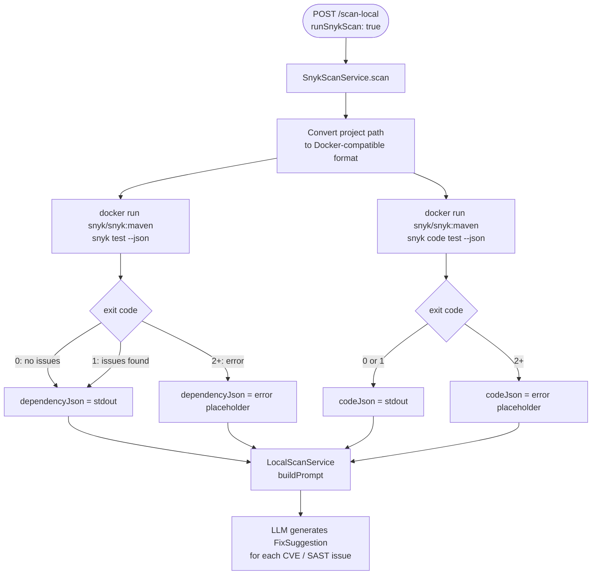

# Snyk Integration — Dependency & Code Security Scanning

This document covers how Snyk is integrated into `LocalDevScanMcpDemo` to detect dependency vulnerabilities (CVEs) and SAST code issues as part of the local pre-PR quality gate.

---

## Table of Contents

1. [What is Snyk?](#what-is-snyk)
2. [How Snyk Fits Into the Scan Pipeline](#how-snyk-fits-into-the-scan-pipeline)
3. [Scan Types](#scan-types)
4. [How It Works — Under the Hood](#how-it-works--under-the-hood)
5. [Docker Images](#docker-images)
6. [Getting a Snyk Token](#getting-a-snyk-token)
7. [Configuration](#configuration)
8. [Output Format](#output-format)
9. [Troubleshooting](#troubleshooting)

---

## What is Snyk?

[Snyk](https://snyk.io) is a developer security platform that scans your project for:

| Scan type | What it finds |
|-----------|--------------|
| **`snyk test`** (open-source) | Known CVEs in your dependencies (`pom.xml`, `package.json`, etc.) |
| **`snyk code test`** (SAST) | Security issues in your own source code (injection, XSS, hardcoded secrets, etc.) |

Snyk has a **free tier** that covers unlimited open-source scans and a limited number of SAST scans per month — enough for local development use.

---

## How Snyk Fits Into the Scan Pipeline



---

## Scan Types

### 1. Dependency Scan — `snyk test`

Analyses your dependency manifest (`pom.xml` for Maven, `build.gradle` for Gradle) and checks each dependency against the Snyk vulnerability database.

**What it finds:**
- Known CVEs (e.g. `CVE-2021-44228` Log4Shell)
- Snyk-tracked vulnerabilities with severity (Critical / High / Medium / Low)
- Transitive (indirect) dependency vulnerabilities
- Fix advice — which version to upgrade to

**Example output entry:**
```json
{
  "id": "SNYK-JAVA-ORGAPACHELOGGINGLOG4J-2314720",
  "title": "Remote Code Execution (RCE)",
  "severity": "critical",
  "packageName": "log4j-core",
  "version": "2.14.1",
  "fixedIn": ["2.15.0"],
  "CVSSv3": "10.0"
}
```

**FixSuggestion generated by LLM:**
```json
{
  "file": "pom.xml",
  "issue": "Remote Code Execution in log4j-core 2.14.1 (CVE-2021-44228)",
  "severity": "CRITICAL",
  "source": "snyk",
  "ruleId": "SNYK-JAVA-ORGAPACHELOGGINGLOG4J-2314720",
  "originalCode": "<version>2.14.1</version>",
  "suggestedCode": "<version>2.17.1</version>",
  "explanation": "Upgrade log4j-core to 2.17.1 to fix the Log4Shell RCE vulnerability"
}
```

---

### 2. SAST Scan — `snyk code test`

Performs static application security testing (SAST) directly on your source code.

**What it finds:**
- SQL injection
- Cross-site scripting (XSS)
- Path traversal
- Hardcoded credentials
- Insecure cryptographic usage
- Command injection

> **Note:** `snyk code test` is available in `snyk/snyk:maven` and most other images. It may return exit code 2 (error) if SAST is not enabled on your Snyk account's free tier. The app handles this gracefully — a failure here does not block the overall scan.

---

## How It Works — Under the Hood

### `SnykScanService`

```
SnykScanService.scan(projectPath)
    │
    ├── toDockerPath(projectPath)
    │       Converts Windows path to Docker-compatible format
    │       C:\Users\foo\project  →  /c/Users/foo/project
    │       C:/Users/foo/project  →  /c/Users/foo/project
    │
    ├── runSnykCommand(dockerPath, "snyk", "test", "--json")
    │       docker run --rm
    │         -e SNYK_TOKEN=<token>
    │         -v /c/Users/foo/project:/project
    │         -w /project
    │         snyk/snyk:maven
    │         snyk test --json
    │
    └── runSnykCommand(dockerPath, "snyk", "code", "test", "--json")
            docker run --rm ... snyk code test --json
```

### Exit code handling

| Exit code | Meaning | Handled as |
|-----------|---------|------------|
| `0` | Scan complete, no issues | Valid JSON result |
| `1` | Scan complete, issues found | Valid JSON result (this is normal) |
| `2+` | Scan error (auth, Docker, network) | `null` → placeholder error JSON |
| `-1` | Timed out (5 min limit) | `null` → placeholder error JSON |

### Path conversion

On Windows, project paths must be converted before Docker can mount them:

```
C:\Users\Deepak\project   →   /c/Users/Deepak/project
C:/Users/Deepak/project   →   /c/Users/Deepak/project
/home/user/project        →   /home/user/project  (no change)
```

The `toDockerPath()` method handles all three formats automatically.

### Why `snyk` prefix in the Docker command?

The `snyk/snyk:*` Docker images use an entrypoint that passes arguments directly to the Snyk CLI. The correct invocation is:

```bash
# Correct
docker run snyk/snyk:maven snyk test --json

# Wrong — entrypoint will fail
docker run snyk/snyk:maven test --json
```

### Why `SNYK_ORG` is NOT passed to Docker

Passing `SNYK_ORG` as an environment variable to the Docker container causes a **403 Forbidden** response from the Snyk API. The org ID is only needed for certain enterprise API endpoints, not for standard `snyk test`. It is intentionally excluded from the Docker command.

---

## Docker Images

The Snyk Docker images are pre-built with the project's package manager included. Using the wrong image for your project type will cause the scan to fail.

| Project type | Docker image | Package manager included |
|-------------|-------------|--------------------------|
| **Maven (Java)** | `snyk/snyk:maven` | `mvn` ✅ — **use this for Spring Boot** |
| Gradle (Java) | `snyk/snyk:gradle` | `gradle` ✅ |
| Node.js | `snyk/snyk:node` | `npm` / `yarn` ✅ — no `mvn`, **do not use for Java** |
| Python | `snyk/snyk:python` | `pip` ✅ |
| Ruby | `snyk/snyk:ruby` | `bundler` ✅ |
| .NET | `snyk/snyk:dotnet` | `dotnet` ✅ |

> **Important:** `snyk/snyk:node` does not contain Maven. If used with a Java project, the scan will fail with `spawn mvn ENOENT`. Always use `snyk/snyk:maven` for Maven/Spring Boot projects.

Configure the image in `application.yaml`:

```yaml
snyk:
  docker-image: snyk/snyk:maven   # change to snyk/snyk:gradle for Gradle projects
```

---

## Getting a Snyk Token

### Step 1 — Create a free Snyk account

Go to [app.snyk.io](https://app.snyk.io) and sign up with GitHub, Google, or email.

### Step 2 — Get your API token

1. Log in to [app.snyk.io](https://app.snyk.io)
2. Click your **avatar** (top right) → **Account Settings**
3. Under **Auth Token**, click **Click to show**
4. Copy the token (format: `xxxxxxxx-xxxx-xxxx-xxxx-xxxxxxxxxxxx`)

### Step 3 — Add to configuration

Set it in `application.yaml`:

```yaml
snyk:
  token: your-snyk-token-here
  docker-image: snyk/snyk:maven
```

Or pass as an environment variable:

```bash
SNYK_TOKEN=your-token java -jar build/libs/LocalDevScanMcpDemo-0.0.1-SNAPSHOT.jar
```

---

## Configuration

All Snyk config lives under the `snyk` key in `application.yaml`:

```yaml
snyk:
  token: a23d51f8-xxxx-xxxx-xxxx-xxxxxxxxxxxx   # your Snyk API token
  docker-image: snyk/snyk:maven                  # Docker image for scanning
```

Mapped to `SnykProperties.java`:

```java
@Component
@ConfigurationProperties(prefix = "snyk")
public class SnykProperties {
    private String token;
    private String dockerImage;
    // getters/setters
}
```

### Disabling Snyk

Set `runSnykScan: false` in the scan request to skip Snyk entirely:

```json
{
  "projectPath": "C:/path/to/project",
  "sonarProjectKey": "my-key",
  "runSnykScan": false
}
```

---

## Output Format

When Snyk scans run successfully, the raw JSON is passed to the LLM alongside SonarQube issues (truncated to 5000 characters each to stay within token limits).

### Dependency scan JSON structure (`snyk test --json`)

```json
{
  "vulnerabilities": [
    {
      "id": "SNYK-JAVA-...",
      "title": "Vulnerability title",
      "severity": "high",
      "packageName": "affected-package",
      "version": "1.0.0",
      "fixedIn": ["1.0.1"],
      "description": "...",
      "CVSSv3": "9.8",
      "exploit": "Proof of Concept"
    }
  ],
  "dependencyCount": 42,
  "ok": false,
  "summary": "56 vulnerable dependency paths"
}
```

### Code scan JSON structure (`snyk code test --json`)

```json
{
  "runs": [
    {
      "results": [
        {
          "ruleId": "javascript/SqlInjection",
          "message": { "text": "Unsanitized input flows into SQL query" },
          "locations": [
            {
              "physicalLocation": {
                "artifactLocation": { "uri": "src/main/java/..." },
                "region": { "startLine": 42, "endLine": 44 }
              }
            }
          ],
          "level": "error"
        }
      ]
    }
  ]
}
```

### LLM prompt section

The Snyk JSON sections appear in the prompt sent to the LLM like this:

```
## Snyk Dependency Vulnerabilities
```json
{ ... snyk test output ... }
```

## Snyk Code Issues
```json
{ ... snyk code test output ... }
```
```

The LLM is instructed to set `"source": "snyk"` and `"file": "pom.xml"` for dependency fixes.

---

## Troubleshooting

### Docker not running

```
Error: Cannot connect to the Docker daemon
```

Start Docker Desktop and wait for it to be ready (`docker ps` should work with no error).

---

### Snyk authentication failure (exit code 2)

```
{"error": "Authentication failed. Please run `snyk auth`."}
```

Your `SNYK_TOKEN` is invalid or expired. Regenerate it from [app.snyk.io/account](https://app.snyk.io/account).

---

### `spawn mvn ENOENT` — wrong Docker image

```
{"error": "Failed to run 'mvn'..."}
```

You are using `snyk/snyk:node` or another image that does not include Maven. Change `snyk.docker-image` to `snyk/snyk:maven`.

---

### `snyk code test` always fails

`snyk code test` requires the **Snyk Code** feature to be enabled on your account. On the free tier it may not be available in all regions. This is handled gracefully — the app logs a warning and continues with the dependency scan result only.

Check in [app.snyk.io](https://app.snyk.io): **Settings → Snyk Code** → ensure it is toggled on.

---

### Scan times out (5 minutes)

Large projects with hundreds of dependencies may take longer. The timeout is hardcoded to 5 minutes (`TimeUnit.MINUTES`). For very large projects, consider running Snyk outside the app and feeding the JSON directly.

---

### Windows path issues with Docker volume mount

If you see errors like `invalid mount config` or the container cannot find `/project`:

- Make sure the project path uses forward slashes: `C:/Users/...` not `C:\Users\...`
- `SnykScanService.toDockerPath()` handles both formats automatically
- On Git Bash, set `MSYS_NO_PATHCONV=1` to prevent path conversion by the shell

---

### 403 Forbidden from Snyk API

This happens when `SNYK_ORG` is passed to the Docker container. The integration intentionally does **not** pass `SNYK_ORG` to avoid this. If you have manually added it to the Docker command, remove it.
