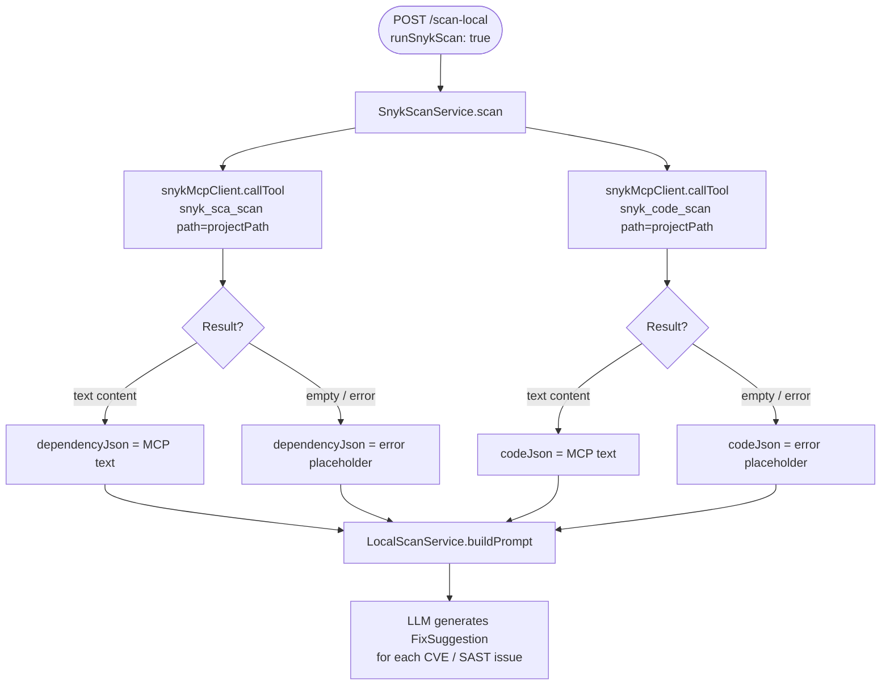

# Snyk Integration — MCP-Based Dependency & Code Security Scanning

This document covers how Snyk is integrated into `LocalDevScanMcpDemo` using the **Snyk MCP server** to detect dependency vulnerabilities (CVEs) and SAST code issues as part of the local pre-PR quality gate.

---

## Table of Contents

1. [What is Snyk?](#what-is-snyk)
2. [How Snyk MCP Fits Into the Scan Pipeline](#how-snyk-mcp-fits-into-the-scan-pipeline)
3. [Scan Types (MCP Tools)](#scan-types-mcp-tools)
4. [How It Works — Under the Hood](#how-it-works--under-the-hood)
5. [Getting a Snyk Token](#getting-a-snyk-token)
6. [Finding Your Snyk Org ID](#finding-your-snyk-org-id)
7. [Installing the Snyk CLI](#installing-the-snyk-cli)
8. [Configuration](#configuration)
9. [Output Format](#output-format)
10. [Troubleshooting](#troubleshooting)

---

## What is Snyk?

[Snyk](https://snyk.io) is a developer security platform that scans your project for:

| Scan type | What it finds |
|-----------|--------------|
| **Open-source (SCA)** | Known CVEs in your dependencies (`pom.xml`, `package.json`, etc.) |
| **Code (SAST)** | Security issues in your own source code (injection, XSS, hardcoded secrets, etc.) |

Snyk has a **free tier** that covers unlimited open-source scans and SAST scans — enough for local development use.

---

## How Snyk MCP Fits Into the Scan Pipeline



The Snyk MCP server starts **once at application boot** and is reused for every scan — no Docker container launched per scan, no volume mounting, no path conversion needed.

---

## Scan Types (MCP Tools)

### 1. `snyk_sca_scan` — Dependency Vulnerability Scan

Analyses your dependency manifest (`pom.xml` for Maven, `build.gradle` for Gradle) and checks each dependency against the **Snyk vulnerability database** in the cloud.

**What it finds:**
- Known CVEs (e.g. `CVE-2021-44228` Log4Shell)
- Snyk-tracked vulnerabilities with severity (Critical / High / Medium / Low)
- Transitive (indirect) dependency vulnerabilities
- Upgrade paths — which version fixes the issue

**Example FixSuggestion generated by LLM:**
```json
{
  "file": "pom.xml",
  "issue": "Remote Code Execution in logback-core 1.4.14 (CVE-2025-11226)",
  "severity": "CRITICAL",
  "source": "snyk",
  "ruleId": "SNYK-JAVA-CHQOSLOGBACK-XXXXXXX",
  "originalCode": "<version>1.4.14</version>",
  "suggestedCode": "<version>1.5.17</version>",
  "explanation": "Upgrade logback-core to 1.5.17 to fix the critical CVE"
}
```

---

### 2. `snyk_code_scan` — SAST Code Security Scan

Performs static application security testing (SAST) directly on your source code.

**What it finds:**
- SQL injection
- Cross-site scripting (XSS)
- Path traversal
- Hardcoded credentials
- Insecure cryptographic usage
- Command injection

> **Note:** `snyk_code_scan` requires Snyk Code to be enabled on your account. If it is not enabled, `SnykScanService` logs a warning and the scan proceeds with the SCA results only.

---

## How It Works — Under the Hood

### Local CLI + Snyk Cloud: how they relate

A common question: **why do I need to `npm install -g snyk` if Snyk runs in the cloud?**

The locally installed `snyk` binary serves as the **MCP server process** — your Spring Boot app spawns it as a subprocess and communicates with it over stdio (MCP protocol). The binary itself is just the transport layer. The actual vulnerability intelligence (CVE database, SAST rules) lives in **Snyk Cloud** — the CLI authenticates to `snyk.io` using your `SNYK_TOKEN` and pulls live data on every scan.

```
Spring Boot app
    │
    └── spawns subprocess: snyk mcp -t stdio --disable-trust
            │  (locally installed snyk CLI — acts as MCP server)
            │
            └── authenticates to Snyk Cloud (snyk.io) via SNYK_TOKEN
                    │
                    ├── snyk_sca_scan → checks pom.xml deps against Snyk CVE DB
                    └── snyk_code_scan → uploads source for SAST analysis
                            │
                            └── returns results via stdio → Spring Boot app
```

**Key points:**
- The local `snyk` binary is required — it's the MCP server; without it the app fails to start
- A valid `snyk.token` is required — without it the CLI cannot authenticate to Snyk Cloud and scans return an auth error
- No Docker volume mounting — unlike the old approach, the CLI reads the project path directly from the filesystem
- CVE data is live from Snyk Cloud — not a local offline database

---

### Startup (once at boot)

```
McpClientsConfig.snykMcpClient()
    │
    ├── Inherit system environment (PATH, USERPROFILE, etc.)
    ├── Add SNYK_TOKEN  ← from snyk.token in application.yaml
    ├── Add SNYK_CFG_ORG  ← from snyk.org-id in application.yaml
    │
    ├── Windows: cmd /c snyk mcp -t stdio --disable-trust
    └── Linux/Mac: snyk mcp -t stdio --disable-trust
            │
            └── StdioClientTransport (MCP stdio protocol)
                    → snykMcpClient.initialize()
                    → "Snyk MCP client ready — 11 tool(s) available"
```

`--disable-trust` is essential for headless operation — without it, the MCP server opens a local HTTP server waiting for browser confirmation before allowing any scan.

### Per scan (`SnykScanService.scan`)

```
SnykScanService.scan(projectPath)
    │
    ├── callTool("snyk_sca_scan", {path: projectPath})
    │       Snyk CLI reads pom.xml / build.gradle
    │       Checks dependencies against Snyk Cloud vulnerability DB
    │       Returns: text report (up to 370KB of CVE data)
    │
    └── callTool("snyk_code_scan", {path: projectPath})
            Snyk CLI performs SAST on source files
            Returns: SARIF-format text report
```

Both calls run sequentially. Failures are caught individually — if one tool fails, the other result is still used.

### Available Snyk MCP Tools (full profile)

When the server starts you will see `11 tool(s) available`. The tools are:

| Tool | Used by this app | Purpose |
|------|-----------------|---------|
| `snyk_sca_scan` | ✅ | Open-source dependency CVE scan |
| `snyk_code_scan` | ✅ | SAST code security scan |
| `snyk_container_scan` | — | Container image vulnerability scan |
| `snyk_iac_scan` | — | Infrastructure-as-Code misconfig scan |
| `snyk_sbom_scan` | — | SBOM file analysis |
| `snyk_trust` | — | Not used (disabled via `--disable-trust`) |
| `snyk_auth` | — | Interactive auth (not needed with token) |
| `snyk_version` | — | Display Snyk version |
| others | — | Additional management tools |

---

## Getting a Snyk Token

### Option A — UAT Token (recommended for testing, 90-day expiry)

1. Log in to [app.snyk.io](https://app.snyk.io)
2. Click your avatar (top right) → **Account Settings**
3. Under **Auth Token**, generate a new token

UAT tokens look like:
```
snyk_uat.1fcad39e.eyJlIjox...
```

### Option B — API Token (permanent)

1. Log in to [app.snyk.io](https://app.snyk.io)
2. Avatar → **Account Settings** → **Auth Token** → **Click to show**
3. Copy the UUID-format token: `xxxxxxxx-xxxx-xxxx-xxxx-xxxxxxxxxxxx`

Set in `application.yaml`:

```yaml
snyk:
  token: snyk_uat.1fcad39e.eyJ...   # or UUID format
```

---

## Finding Your Snyk Org ID

The org ID is the **slug** (not the UUID) of your Snyk organization.

1. Log in to [app.snyk.io](https://app.snyk.io)
2. Click the organisation dropdown (top left)
3. Your org slug appears in the URL: `app.snyk.io/org/`**`vivid-vortex`**`/...`
4. Or: **Settings → General** → **Organization name** (the slug, not the display name)

Set in `application.yaml`:

```yaml
snyk:
  org-id: vivid-vortex   # slug, not UUID
```

This is passed to the Snyk MCP server as `SNYK_CFG_ORG`.

---

## Installing the Snyk CLI

The Snyk MCP server requires the Snyk CLI (`snyk` binary) installed globally. Install it once per machine:

```bash
npm install -g snyk
```

Verify:
```bash
snyk --version   # should print 1.1298.0 or later (MCP support added in 1.1298.0)
```

> **Why not npx?** Using `npx -y snyk@latest mcp -t stdio` would download Snyk on every app startup and might write progress messages to stdout, corrupting the MCP stdio protocol. A globally installed `snyk` binary starts cleanly with no download output.

> **Minimum version:** MCP support (`snyk mcp`) was added in Snyk CLI **v1.1298.0**. If `snyk mcp --help` gives an error, run `npm install -g snyk@latest` to upgrade.

---

## Configuration

All Snyk config lives under the `snyk` key in `application.yaml`:

```yaml
snyk:
  token: snyk_uat.1fcad39e.eyJ...      # your Snyk token (UAT or API)
  org-id: vivid-vortex                  # your Snyk org slug
```

Mapped to `SnykProperties.java`:

```java
@Component
@ConfigurationProperties(prefix = "snyk")
public class SnykProperties {
    private String token;
    private String orgId;
    // getters/setters
}
```

### Disabling Snyk

Set `run-snyk-scan: false` in `application.yaml` (or `runSnykScan: false` in the scan request) to skip Snyk entirely:

```yaml
scan:
  run-snyk-scan: false   # skip Snyk, use only SonarQube results
```

---

## Output Format

Both Snyk MCP tools return text content that is passed to the LLM (each truncated to 5,000 characters to stay within token limits).

### `snyk_sca_scan` response

Returns a structured text report listing vulnerable packages:

```
✗ High severity vulnerability found in ch.qos.logback/logback-core@1.4.14
  Description: ...
  Info: https://security.snyk.io/vuln/SNYK-JAVA-CHQOSLOGBACK-...
  Introduced through: ...
  Fixed in: 1.5.17
```

### `snyk_code_scan` response (SARIF-like text)

```
✗ [HIGH] Hardcoded Secret
  Path: src/main/java/com/example/demo/HelloController.java, line 11
  Info: A hardcoded credential was found...
```

### LLM prompt sections

The Snyk results appear in the prompt like this:

```
## Snyk Dependency Vulnerabilities
<snyk_sca_scan output truncated to 5000 chars>

## Snyk Code Issues
<snyk_code_scan output truncated to 5000 chars>
```

The LLM is instructed to set `"source": "snyk"` and `"file": "pom.xml"` for dependency fixes so `AutoFixService` knows to patch `pom.xml` rather than a Java source file.

---

## Troubleshooting

### `snyk: command not found` — server fails to start

```
Error: Application context initialization failed
```

The Snyk CLI is not installed or not on PATH. Fix:

```bash
npm install -g snyk
snyk --version
```

On Windows, restart your terminal (or IDE) after installing so the new PATH takes effect.

---

### `Snyk MCP client ready — 0 tool(s) available`

The Snyk MCP server started but reported no tools. This can happen if:
- The Snyk CLI version is older than 1.1298.0 (MCP support not included)
- `snyk mcp --help` returns an error

Fix: upgrade the CLI:
```bash
npm install -g snyk@latest
snyk --version
```

---

### `snyk_sca_scan` returns error — authentication failed

```
{"error": "Authentication failed. Please run snyk auth."}
```

Your `snyk.token` in `application.yaml` is invalid or expired (UAT tokens expire after 90 days). Regenerate from [app.snyk.io/account](https://app.snyk.io/account) and update `application.yaml`.

---

### `snyk_code_scan` always returns empty / error

Snyk Code (SAST) must be enabled on your account:

1. Log in to [app.snyk.io](https://app.snyk.io)
2. Go to **Settings → Snyk Code**
3. Toggle **Enable Snyk Code** → On

The app handles this gracefully — dependency scan (`snyk_sca_scan`) still runs and returns results even if code scan fails.

---

### `snyk_sca_scan` returns "No supported manifest files detected"

The project directory does not contain a recognised package manifest (`pom.xml`, `build.gradle`, `package.json`, etc.). This is expected when scanning a bare git branch with only source files and no build config.

Fix: set `run-snyk-scan: false` for repositories without a build manifest:

```yaml
scan:
  run-snyk-scan: false
```

---

### Snyk scan returns results but they're not in the LLM fix suggestions

The Snyk output is truncated to 5,000 characters before being sent to the LLM. For projects with many vulnerabilities, only the first ~5KB of the Snyk report is included. The LLM picks the most actionable issues from what it sees.

---

### Server starts but Snyk MCP client takes 30+ seconds to initialize

On the first run after installing or upgrading the Snyk CLI, the CLI performs a background check. Subsequent starts are faster (typically 5–10 seconds). This is normal.
